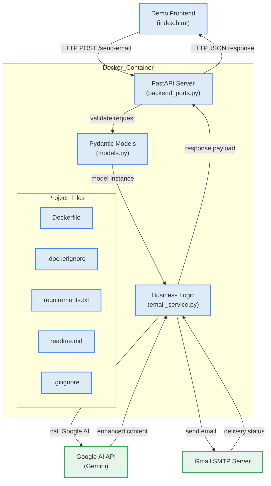

# Email Service API

A powerful REST API that transforms any website's contact form into an intelligent email delivery system. Built with FastAPI and integrated with Gmail SMTP, this service not only sends emails reliably but also enhances your content using AI technology.

**Perfect for:**
- Portfolio websites with contact forms
- Business websites needing reliable email delivery
- Developers who want to add smart email functionality without the complexity
- Any web application requiring contact form integration

**Key Features:**
- 🚀 Easy integration with existing contact forms
- 🤖 AI-enhanced content generation for better communication
- 📧 Reliable Gmail SMTP delivery
- ⚡ Fast, lightweight FastAPI backend
- 🐳 Docker-ready for easy deployment
- 🔒 Secure email handling with API key authentication
- 🛡️ Protected endpoints to prevent unauthorized access

Simply integrate this API with your website's contact form and let it handle the rest - from content enhancement to reliable delivery.

## Architecture Overview



## Quick Start

1. **Install dependencies**
```bash
pip install -r requirements.txt
```

2. **Configure environment**
Create a `.env` file:
```env
EMAIL_USER=your-gmail@gmail.com
EMAIL_PASS=your-app-password
GOOGLE_API_KEY=your-google-api-key
API_KEY=Your custom API # To access this REST API (API Key for authentication)
```

3. **Run the service**
```bash
python backend_ports.py
```

API available at: http://localhost:7860

**Live API**: https://email-service-9f1z.onrender.com/docs

## API Usage

**Endpoint**: `POST /send-email`

**Live Endpoint**: https://email-service-9f1z.onrender.com/send-email

**Authentication**: All email endpoints require API key authentication via the `X-API-Key` header.

**Headers**:
```
Content-Type: application/json
X-API-Key: your-api-key-here
```

**Request**:
```json
{
    "name": "John Doe",
    "email": "john@example.com", 
    "message": "Hello, this is a test message!",
    "to": "contact@yoursite.com"
}
```

**Response**:
```json
{
    "message": "Email from John Doe sent successfully!",
    "success": true
}
```

**Error Response** (Invalid API Key):
```json
{
    "detail": "Invalid API Key"
}
```

### Example Usage

```bash
curl -X POST "https://email-service-9f1z.onrender.com/send-email" \
  -H "Content-Type: application/json" \
  -H "X-API-Key: your-api-key-here" \
  -d '{
    "name": "John Doe",
    "email": "john@example.com",
    "message": "Hello, this is a test message!",
    "to": "contact@yoursite.com"
  }'
```

### JavaScript Example

```javascript
fetch('https://email-service-9f1z.onrender.com/send-email', {
  method: 'POST',
  headers: {
    'Content-Type': 'application/json',
    'X-API-Key': 'your-api-key-here'
  },
  body: JSON.stringify({
    name: 'John Doe',
    email: 'john@example.com',
    message: 'Hello, this is a test message!',
    to: 'contact@yoursite.com'
  })
})
.then(response => response.json())
.then(data => console.log(data));
```

## Gmail Setup

1. Enable 2-Factor Authentication in your Google Account
2. Generate App Password: Security → 2-Step Verification → App passwords
3. Use the app password in your `.env` file

## Google AI Setup

1. Go to [Google AI Studio](https://aistudio.google.com/app/apikey)
2. Create a new API key for Gemini
3. Add the API key to your `.env` file as `GOOGLE_API_KEY`

## Security

The API now includes mandatory API key authentication to ensure secure access to email endpoints. This prevents unauthorized usage and protects your email service from abuse.

**Authentication Method**: 
- All email sending endpoints require a valid API key
- API key must be provided in the `X-API-Key` header
- Invalid or missing API keys return a 403 Forbidden error

**Setting up API Key**:
1. Generate a secure API key (recommended: use a UUID or cryptographically secure random string)
2. Add it to your `.env` file as `API_KEY=your-secure-api-key`
3. Include the API key in all requests to protected endpoints

## Requirements

- Python 3.7+
- Gmail account with 2FA enabled
- App-specific password for Gmail
- Google API key for AI features
- Secure API key for authentication (required)